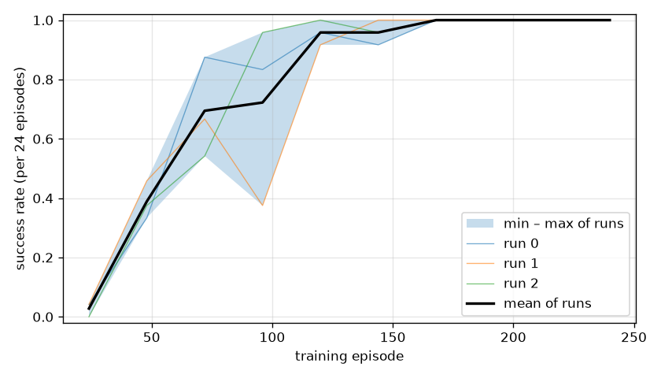
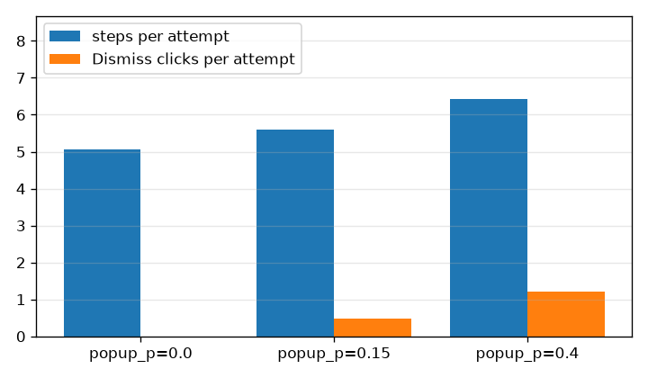

# MiniShop RL report

Every number here is computed by `analysis/report.py` from the JSON logs in `logs/`. Run `./run.sh` to regenerate the logs and this file.

- Training: 3 runs (seeds 0, 1, 2), 240 episodes each, cycling through all 12 goals, popup_p=0.15, delay_p=0.10.
- Testing: page seeds that never appear in training. Greedy policy, no learning.
- Training plus testing took 319 s (5.3 min) on this machine.

## 1. How often does each agent succeed?

Test attempts at popup_p=0.15, delay_p=0.10. Intervals are 95% Wilson score intervals.

| agent | attempts | successes | rate | 95% CI |
|---|---|---|---|---|
| random | 216 | 7 | 3.2% | 1.6% – 6.5% |
| Q-learning (3 runs pooled) | 216 | 216 | 100.0% | 98.3% – 100.0% |
| Q-learning run 0 | 72 | 72 | 100.0% | 94.9% – 100.0% |
| Q-learning run 1 | 72 | 72 | 100.0% | 94.9% – 100.0% |
| Q-learning run 2 | 72 | 72 | 100.0% | 94.9% – 100.0% |

The random agent fails mostly by step limit (133 of 216 attempts). All its outcomes: {'step_limit': 133, 'wrong_order': 76, 'success': 7}.

## 2. How the learning agent improves during training

Success rate in blocks of 24 training episodes (2 per goal). Exploration ε falls from 1.0 to 0.05 over the first 80% of training.

| episodes | mean | min | max | std |
|---|---|---|---|---|
| 1–24 | 3% | 0% | 4% | 0.02 |
| 25–48 | 39% | 33% | 46% | 0.05 |
| 49–72 | 69% | 54% | 88% | 0.14 |
| 73–96 | 72% | 38% | 96% | 0.25 |
| 97–120 | 96% | 92% | 100% | 0.03 |
| 121–144 | 96% | 92% | 100% | 0.03 |
| 145–168 | 100% | 100% | 100% | 0.00 |
| 169–192 | 100% | 100% | 100% | 0.00 |
| 193–216 | 100% | 100% | 100% | 0.00 |
| 217–240 | 100% | 100% | 100% | 0.00 |

## 3. Learning agent with popup_p = 0, 0.15 and 0.4

| popup_p | attempts | success rate (95% CI) | steps per attempt | Dismiss clicks per attempt | waits per attempt | time per attempt |
|---|---|---|---|---|---|---|
| 0.0 | 216 | 100.0% (98.3% – 100.0%) | 5.06 | 0.00 | 0.76 | 91 ms |
| 0.15 | 216 | 100.0% (98.3% – 100.0%) | 5.59 | 0.47 | 0.79 | 95 ms |
| 0.4 | 216 | 100.0% (98.3% – 100.0%) | 6.42 | 1.22 | 0.81 | 99 ms |

Success barely moves (100.0% → 100.0% → 100.0%); the cost of popups shows up as length. From popup_p=0.0 to popup_p=0.4 an attempt grows from 5.06 to 6.42 steps, and Dismiss clicks grow from 0.00 to 1.22 per attempt. Each screen change can raise a popup, the popup makes every other button unclickable, and the agent learned in training (popup_p=0.15) that the only useful action in a popup state is Dismiss. The popup flag is part of its state, so a higher popup rate only means visiting the popup states more often, not meeting new ones. An attempt without popups takes 5.06 steps on average and 20 are allowed, so the extra clicks rarely push an attempt into the step limit.

## 4. Why the learning agent fails

- Test attempts that failed: 0 of 648.
- Failures in the last 20% of training (ε at its 0.05 floor): 0 of 144.
- Failures over all of training, mostly while still exploring: 162 of 720.

Most common reasons (training failures):

| reason | count |
|---|---|
| hit the 20-step limit on the product screen | 65 |
| hit the 20-step limit on the catalog screen | 38 |
| hit the 20-step limit on the cart screen | 23 |

**hit the 20-step limit on the product screen**: run 0, episode 5, goal `red-mug x3`, page seed 5:

> … → product: - → product: - → product: + → product: Add to cart → cart: wait → cart: Back → product (popup): Add to cart → product (popup): Dismiss

**hit the 20-step limit on the catalog screen**: run 0, episode 3, goal `red-mug x1`, page seed 3:

> … → catalog: View → product: wait → product: + → product: - → product: Back → catalog: View → product: Back → catalog: View

**hit the 20-step limit on the cart screen**: run 0, episode 0, goal `blue-mug x1`, page seed 0:

> … → cart: Clear cart → cart: Back → product: + → product: Add to cart → cart: Clear cart → cart: Clear cart → cart: Clear cart → cart: Clear cart

The greedy agent did not fail on any test attempt, so the reasons above come from training, where ε-greedy exploration still picks random buttons.

## 5. How long does one step take?

Over all 14130 logged steps and 1584 resets (training and testing):

| what | count | median | 95th percentile |
|---|---|---|---|
| any step | 14130 | 2.9 ms | 101.6 ms |
| click step | 11883 | 2.6 ms | 5.7 ms |
| wait step | 2247 | 101.4 ms | 102.6 ms |
| reset (load the page) | 1584 | 28.7 ms | 46.7 ms |

Share of all measured time:

| part | total | share |
|---|---|---|
| page loads (reset) | 49.8 s | 16% |
| wait steps | 228.3 s | 73% |
| click steps | 35.2 s | 11% |

A typical step is a click and takes 2.6 ms: sending the mouse press and release takes a median of 1.9 ms and reading the page back 0.7 ms. The slow case is the wait action, which sleeps 100 ms by design. Overall, the most time goes into wait steps (73% of measured time). Of the whole 319 s run, 313 s is measured here; the rest is starting Chrome, the agent's own work and writing logs.

## 6. What surprised me

How much the choice of state mattered compared with anything else. The agent's state is not the raw page: it describes the page relative to the goal (for example `product:qty-low` = right item, quantity too low). Because of that, what the agent learns about `+` on one goal is reused on all twelve, and the mean success rate across runs goes from 3% in the first 24 episodes to 100% in the last 24. A first version that used the raw goal and page text as the state learned each goal separately and was much slower (see DECISIONS.md). A smaller surprise was how cheap a real click through CDP is: a median of 2.6 ms, while loading the page fresh for each attempt takes 29 ms, about 11 clicks' worth.
